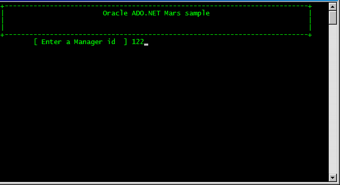
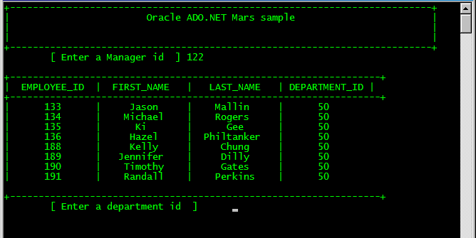
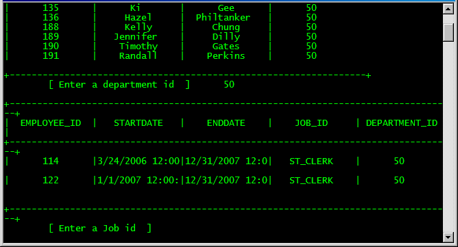
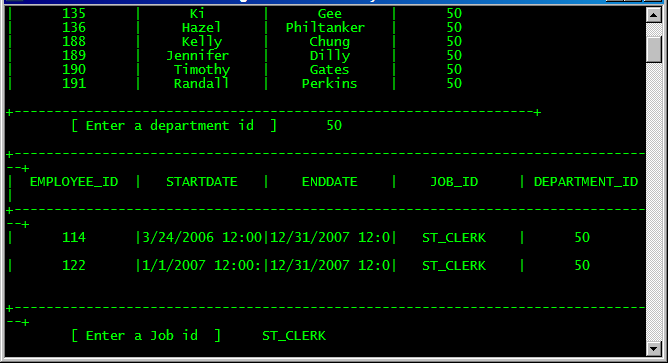
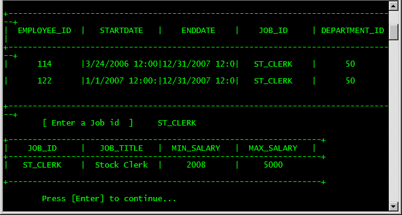

# How to use Multiple Active Result Sets (MARS) with Oracle .NET

Multiple Active Result Sets (MARS) is a feature supported by ADO.NET that allows the execution of multiple batches on a single connection. In previous versions, only one batch could be executed at a time against a single connection. When using a MARS-enabled connection, multiple logical batches can be executed on a single connection. Executing multiple batches with MARS does not imply simultaneous execution of operations.

To access multiple result sets using DataReader objects, multiple Command objects will need to be used. When MARS is enabled, each command object used adds an additional session to the connection.

For enabling MARS on Sql Server connection, only adds the following property at the end of the connection string.

<pre>
connectionString="Data Source=(local);Initial Catalog=Adventureworks;Integrated Security=True;MultipleActiveResultSets=True;Persist Security Info=False"
</pre>
The following program demonstrates how to use a Oracle Connection with MARS enabled.
It runs three command to the samples database HR. The sample database can be downloaded here.

Fig 1. Running the example.

 

Fig 2. Use the first Oracle Datareader for fetching data.

 

Fig 3. 

 

Fig 4. 

 

Fig 5.

 
